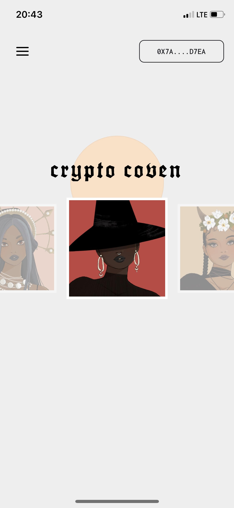
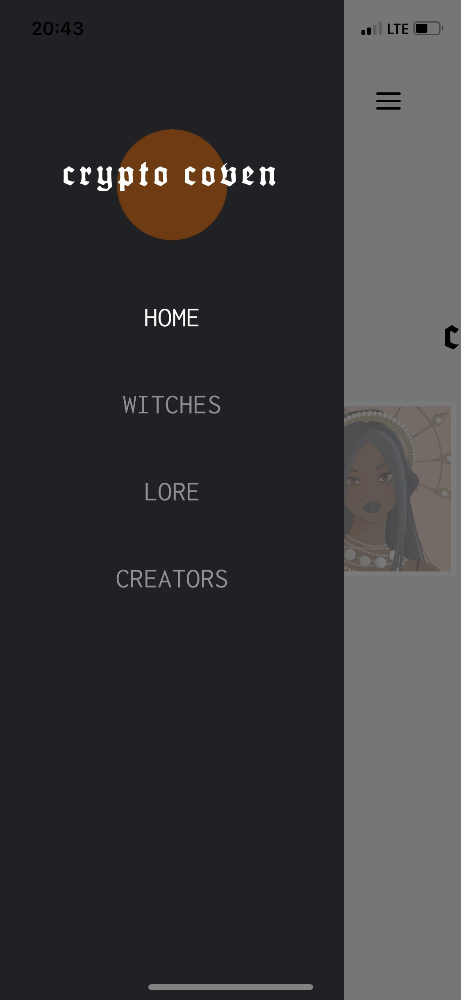
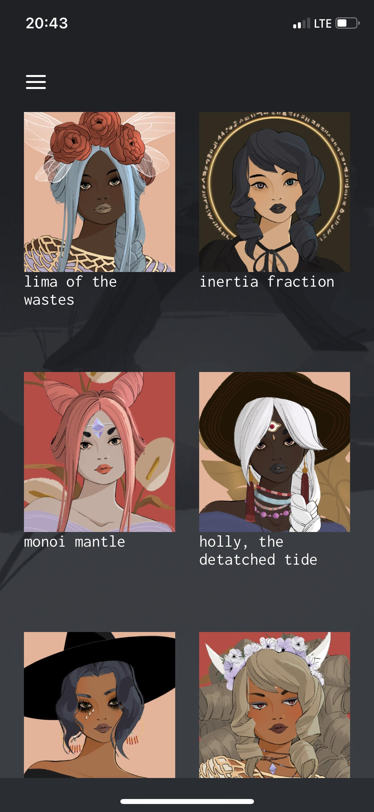

# Crypto Coven Native

A cross-platform mobile application (iOS & Android) that integrates with Metamask and OpenSea APIs, allowing users to connect their Ethereum wallets and view their Crypto Coven NFT assets.

<p align="center">
  
  
  
</p>

## 🧙‍♀️ About

Crypto Coven Native is a mobile dApp that provides a seamless experience for Crypto Coven witch enthusiasts to connect their wallets and view their NFT collections. The app showcases how Web3 technologies can be integrated into mobile applications using React Native.

## 🚀 Tech Stack

- **React Native (Expo)** - Cross-platform mobile development framework
- **TypeScript** - Type-safe JavaScript development
- **Web3.js** - Ethereum blockchain interaction
- **@walletconnect/react-native-dapp** - Mobile wallet connectivity
- **OpenSea API** - NFT asset retrieval and display
- **Styled Components** - Component-level styling
- **React Navigation** - In-app navigation with drawer and native stack
- **Reanimated** - Advanced animations and interactions
- **Expo AV** - Audio-visual components for rich media

## ✨ Features

- Connect to Ethereum wallets via WalletConnect
- View Crypto Coven NFT collections
- Browse witch details and metadata
- Responsive design with custom animations
- Secure blockchain interactions
- Cross-platform compatibility (iOS & Android)

## 🔧 Development

This project was built using Expo, a platform for universal React applications.

### Prerequisites

- Node.js
- Yarn or npm
- Expo CLI
- iOS Simulator or Android Emulator (for local testing)

### Installation

```bash
# Clone the repository
git clone https://github.com/moclei/crypto-coven-native.git

# Navigate to the project
cd crypto-coven-native

# Install dependencies
yarn install

# Start the development server
yarn start
```

## 📱 Building and Running

```bash
# Run on iOS
yarn ios

# Run on Android
yarn android

# Run on web
yarn web
```

## 🧪 Testing

```bash
# Run tests
yarn test
```

## 📄 License

This project is licensed under the MIT License - see the LICENSE file for details.

```sh
npx create-react-native-app -t with-typescript
```

TypeScript is a superset of JavaScript which gives you static types and powerful tooling in Visual Studio Code including autocompletion and useful inline warnings for type errors.

## 🚀 How to use

#### Creating a new project

- Install the CLI: `npm i -g expo-cli`
- Create a project: `npx create-react-native-app -t with-typescript`
- `cd` into the project

### Adding TypeScript to existing projects

- Create a blank TypeScript config: `touch tsconfig.json`
- Run `expo start` to automatically configure TypeScript
- Rename files to TypeScript, `.tsx` for React components and `.ts` for plain typescript files

> 💡 You can disable the TypeScript setup in Expo CLI with the environment variable `EXPO_NO_TYPESCRIPT_SETUP=1 expo start`

## 📝 Notes

- [Expo TypeScript guide](https://docs.expo.dev/versions/latest/guides/typescript/)
